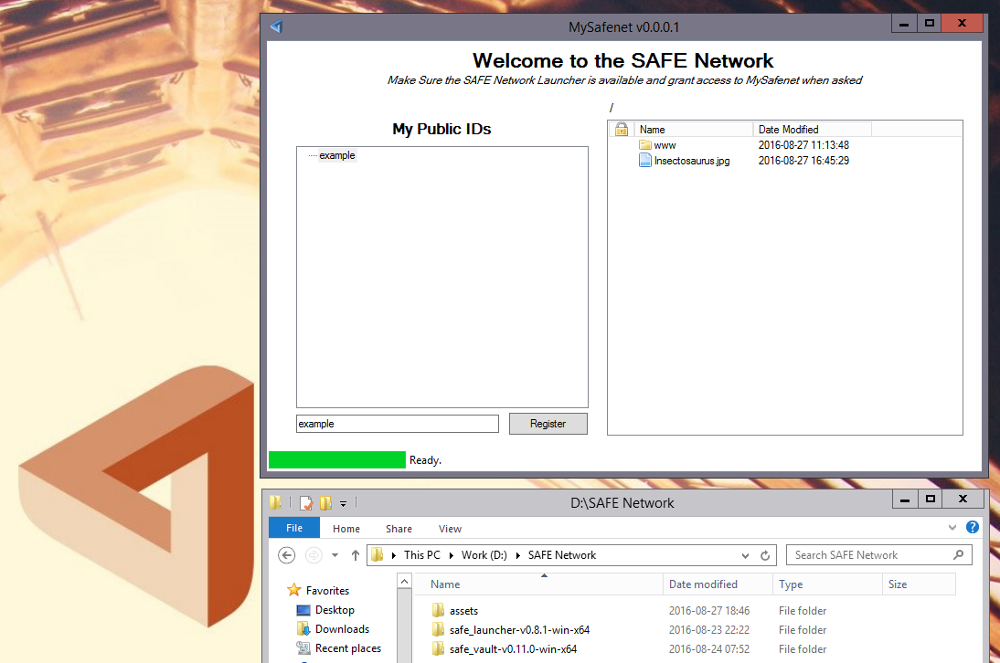

# MySafenet v0.0.0.1

MySafenet is complementary to the [SAFE Demo App](https://maidsafe.readme.io/docs/demo-app) and aims to  help you explore 
the capabilities of the SAFE Network and serve as a sample of a non trivial application built on it.

Once given authorization the main screen shows most of what is offered. You can manage Public IDs and
services and manage files and folders by simply dragging and dropping them.

## Changelog

### v0.0.0.2
* Downloads file & folders from explorer view.

### v0.0.0.1
* Initial release, configure public ids, upload files.

[MySafenet-v0.0.0.1.zip](Files/MySafenet-v0.0.0.1.zip) (.NET + Winforms)\
You find the [source on GitHub](https://github.com/drunkcod/Safenet)

